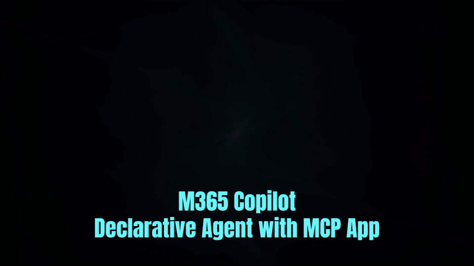
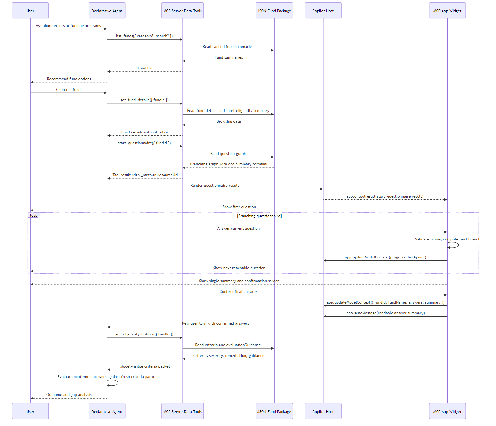
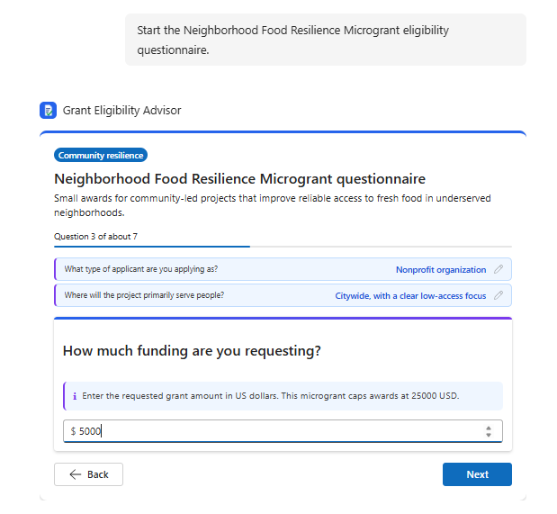
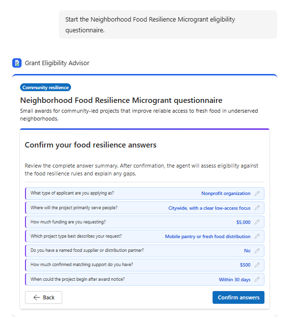
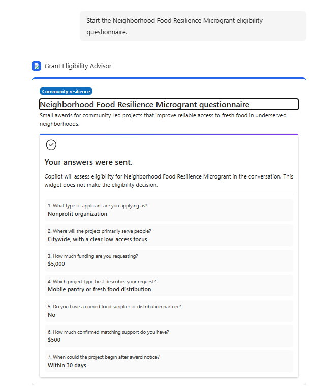
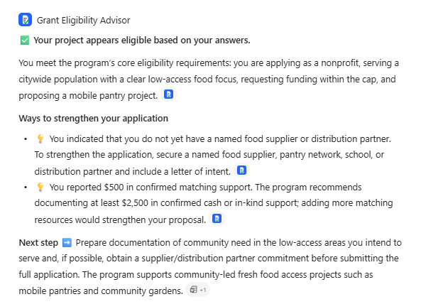

# MCPApp-Sample

MCPApp-Sample is a hand-authored Microsoft 365 Copilot declarative agent sample. It combines a custom Model Context Protocol (MCP) server with an interactive MCP App widget.

Scenario:

- A user asks what grant programs are available.
- The agent opens a branching eligibility questionnaire for the selected fund.
- The widget sends confirmed answers back to the agent, and the agent evaluates them against fund criteria.

This project is **not built with Microsoft 365 Agents Toolkit**. The manifests, MCP server contract, widget contract, and deployment shape are written by hand. That makes the sample useful if you want to understand how the pieces connect without scaffolding hiding the details.

## Demo

## Architecture overview

At a high level the sample has three moving parts and a data store:

- **Declarative agent** — the Copilot-facing app. It owns the instructions and conversation starters, decides when to call MCP tools, and produces the final eligibility explanation. It never renders the questionnaire itself.
- **MCP server** — a stateless Node.js service exposing four read-only tools over Streamable HTTP at `POST /mcp`. It serves fund data, the question graph, and evaluation criteria, and hosts the widget resource. It never computes a verdict.
- **MCP App widget** — a single-page UI the host renders. It walks the user through a branching questionnaire, supports Back, and sends the confirmed answer summary to the agent.
- **Fund package JSON** — trusted, repo-controlled files loaded at server startup. They carry each fund's details, question graph, and eligibility criteria.

The verdict is deliberately split out: the server provides data, the widget collects answers, and only the agent renders the eligibility outcome — using the safer wording *appears eligible based on your answers*.

## Sequence

## Widget walkthrough

**1. Interacting with the questionnaire.** The widget renders one question at a time and follows the branch rules from the fund JSON. Earlier answers stay visible and editable above the current question.

**2. Confirming answers.** Every path reaches the same summary and confirmation screen. The user reviews the complete answer set and can jump back to change any answer before confirming.

**3. Answers sent.** After confirmation the widget shows a read-only receipt of what was submitted and hands the turn back to the agent. The widget does not make the eligibility decision.

**4. Agent result.** The agent fetches the fund criteria, evaluates the confirmed answers, and returns the outcome with specific ways to strengthen the application and a suggested next step.

## Prerequisites

Planned stack:

- Node.js 22
- TypeScript 5.7
- Microsoft 365 Copilot or Copilot Chat with custom app upload enabled
- Azure subscription for App Service deployment
- Microsoft Entra app registration for single sign-on before any real hand-off

## Disclaimer

This project is provided as-is as a reference implementation and sample for educational and demonstration purposes only. It is not intended for production use without thorough review, testing, and hardening appropriate to your environment.

By using this code, you accept full responsibility for any modifications, deployments, and outcomes. The authors make no warranties—express or implied—regarding the suitability, reliability, or security of this solution for any particular purpose. Use of related platforms is subject to their respective terms of service and licensing agreements.

> **In short:** Learn from it, build on it, but validate everything before relying on it.
